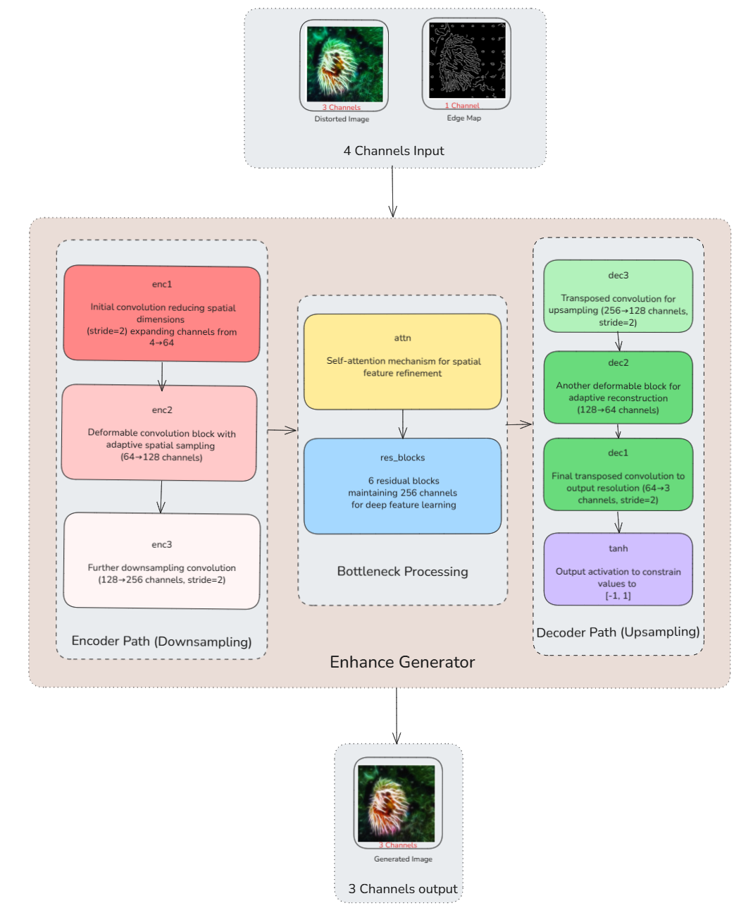
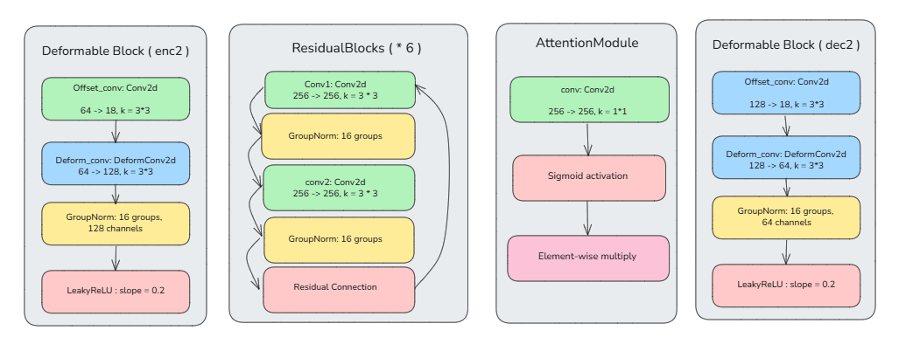
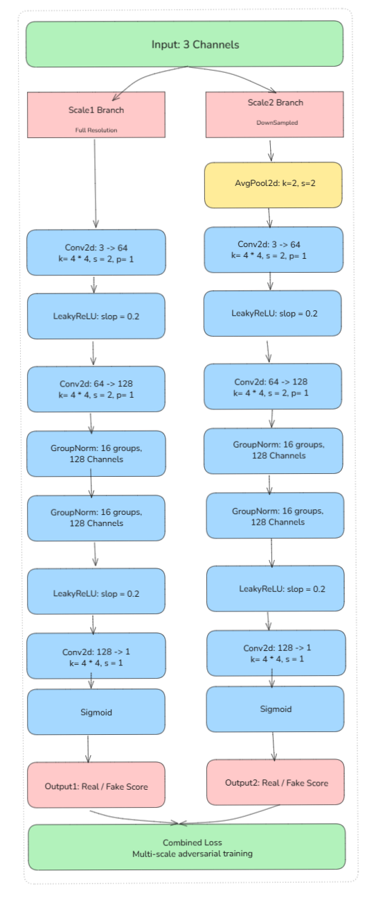
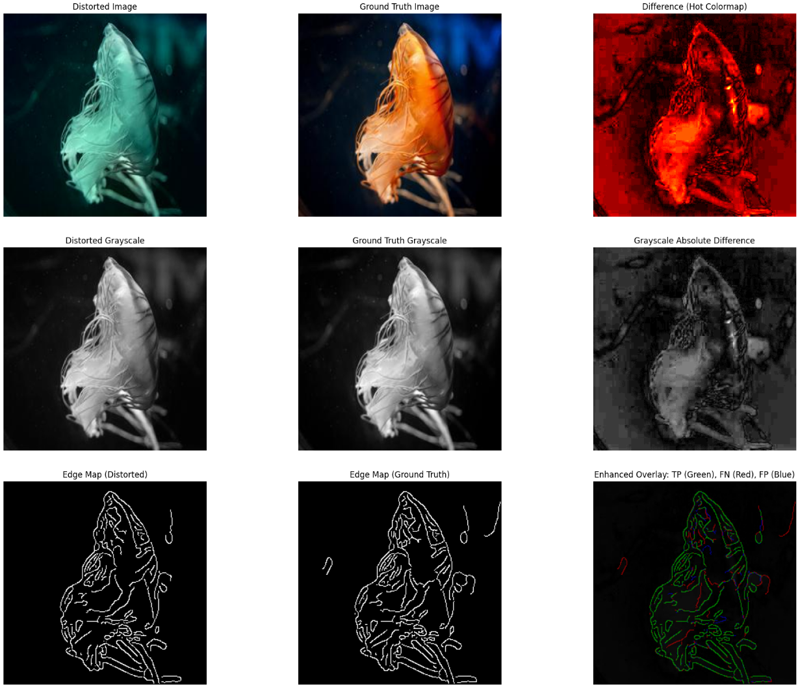
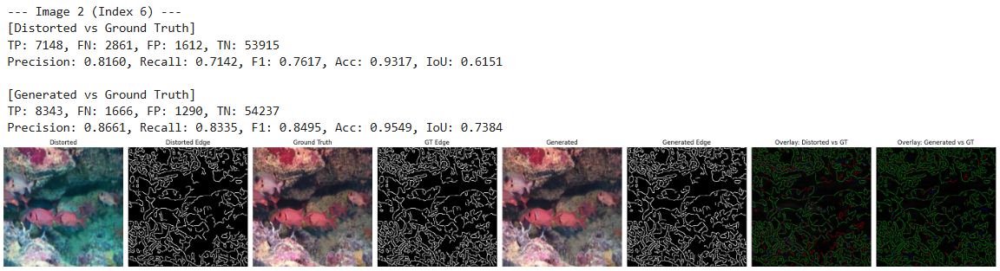
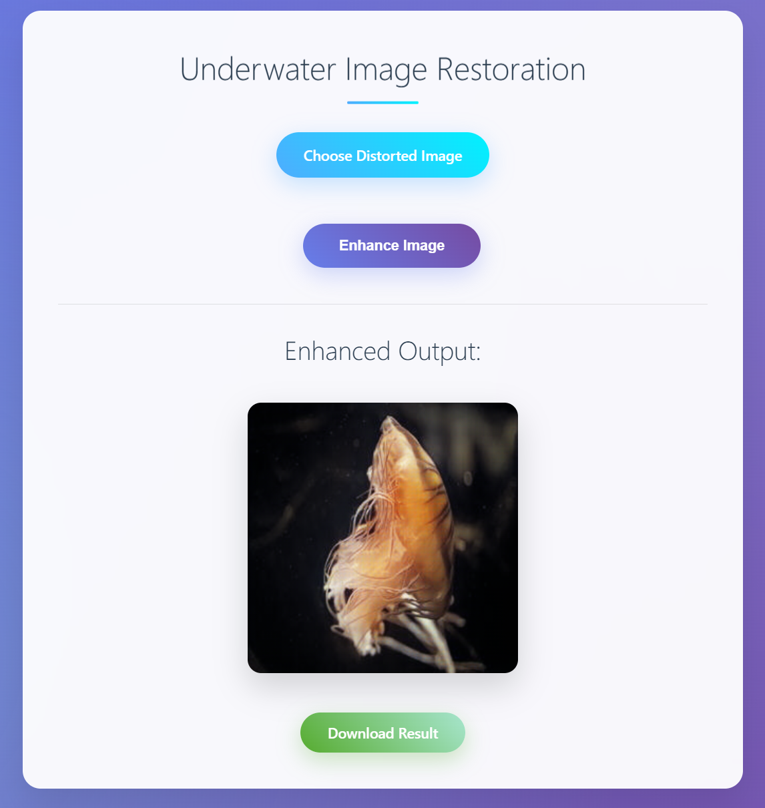

# EP-GAN: Edge-Preserving Generative Adversarial Network

**EP-GAN** is a deep learning-based project focused on enhancing distorted images—especially in challenging scenarios such as underwater or noisy environments. The model is designed with an **enhanced generator** and a **multi-scale discriminator** to produce high-quality, edge-preserved image outputs.


## Architecture Overview

### Enhanced Generator

Our generator is carefully designed to enhance edge features using a combination of attention mechanisms and feature fusion strategies.

**Block Diagram:**  


**Components:**  



### Multi-Scale Discriminator

To ensure perceptual quality and consistency at various resolutions, we employ a multi-scale discriminator that operates on image inputs at different levels of detail.

**Block Diagram:**  



## Experimental Approach & Results

### Distortion Analysis

We begin our experiment with an analysis of common distortions present in sample images. This helps in understanding the degradation patterns and designing effective enhancement strategies.

**Sample Distortion Analysis:**  



### Edge Enhancement Results

Our model shows significant improvements in edge clarity and image fidelity after enhancement.

**Final Result – Edge Enhancement:**  



📌 **Final Result – PSNR & SSIM:**  


## Flask App Integration

To demonstrate real-world applicability, we integrated our best-trained model with a Flask-based web application.

### Web Application Features:
- Upload a distorted image  
- View the enhanced output  
- Download the enhanced image with a single click

**User Interface Screenshot:**  


---

## 🚀 Run EP-GAN Locally

### ✅ Steps to Get Started

1. **Clone the repository**

   ```bash
   git clone https://github.com/plawangshishugit/EP-GAN.git
   ```

2. **Navigate into the project folder**

   ```bash
   cd EP-GAN
   ```

3. **(Optional but recommended) Create and activate a virtual environment**

   ```bash
   python -m venv venv
   venv\Scripts\activate     # On Windows
   source venv/bin/activate  # On Linux/macOS
   ```

4. **Install dependencies**

   ```bash
   pip install -r requirements.txt
   ```

5. **Run the Flask app**

   ```bash
   python app.py
   ```

6. **Open your browser and visit:**

   ```
   http://127.0.0.1:5000
   ```

---

### 📝 Notes

* Make sure the file `generator_best.pth` is inside the `model/` folder.
* Uploaded images are enhanced using your trained **EP-GAN (Edge-Preserving GAN)** generator.
* The output image will appear on the webpage with a download link.

---

### 🎉 Happy Restoring!

Bring clarity to underwater images right from your browser.

