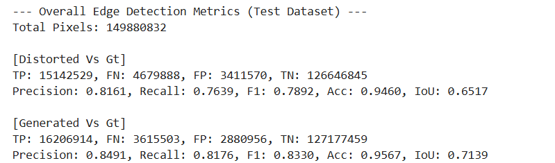
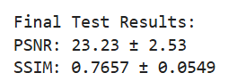

# EP-GAN: Edge-Preserving Generative Adversarial Network

**EP-GAN** is a deep learning-based project focused on enhancing distorted images—especially in challenging scenarios such as underwater or noisy environments. The model is designed with an **enhanced generator** and a **multi-scale discriminator** to produce high-quality, edge-preserved image outputs.

## Architecture Overview

### Enhanced Generator

Our generator is carefully designed to enhance edge features using a combination of attention mechanisms and feature fusion strategies.

**Block Diagram:**  

**Components:**  

### Multi-Scale Discriminator

To ensure perceptual quality and consistency at various resolutions, we employ a multi-scale discriminator that operates on image inputs at different levels of detail.

**Block Diagram:**  

## Experimental Approach & Results

### Distortion Analysis

We begin our experiment with an analysis of common distortions present in sample images. This helps in understanding the degradation patterns and designing effective enhancement strategies.

**Sample Distortion Analysis:**  

### Edge Enhancement Results

Our model shows significant improvements in edge clarity and image fidelity after enhancement.

**Final Result – Edge Enhancement:**  

📌 **Final Result – PSNR & SSIM:**  

## Flask App Integration

To demonstrate real-world applicability, we integrated our best-trained model with a Flask-based web application.

### Web Application Features:
- Upload a distorted image  
- View the enhanced output  
- Download the enhanced image with a single click

**User Interface Screenshot:**  

**Want to use it on local machine**
"""
